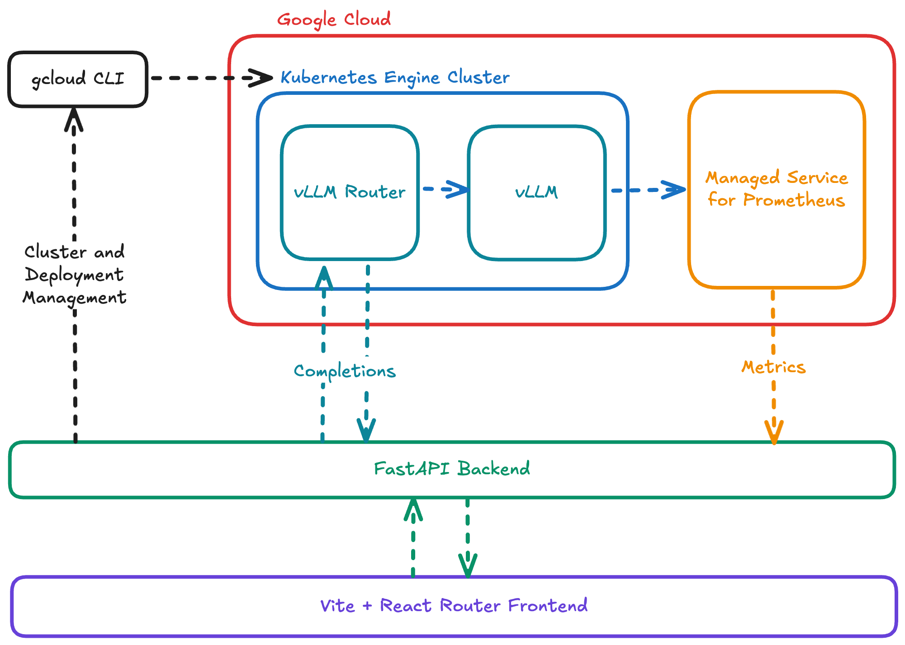

# vDeploy - LLM Deployment Platform

A comprehensive platform for deploying, managing, and monitoring LLM inference services on Kubernetes clusters.

> **Documentation:** [Setup Instructions](instructions.md) | [Platform Specification](spec.md)

## Project Overview

vDeploy is a platform designed to simplify the deployment and management of Large Language Models (LLMs) on Kubernetes clusters. It provides a user-friendly interface for creating and managing clusters, deploying models, monitoring performance metrics, and interacting with deployed models.

## Team

- **Developers**: Yunus Emre Özdemir, Fahreddin Özcan
- **Advisor**: Bahri Atay Özgövde
- **Course**: CMPE492 Senior Project (Spring 2025)

## Features

### Cluster Management

- Create and configure GKE clusters with CPU and GPU nodes
- View cluster details including status, configuration, and node information
- Real-time logs from cluster creation process

### Deployment Management

- Deploy LLMs compatible with vLLM
- Configure deployment settings (CPU, memory, GPU, tensor parallelism)
- Monitor deployment status and health

### Metrics and Monitoring

- Token metrics (prompt tokens, generation tokens, throughput)
- Timing metrics (time to first token, time per output token)
- End-to-end latency metrics (P50, P95, P99)
- Request metrics (requests completed, requests per second)
- GPU metrics (utilization, cache usage)

### Logs

- Real-time log streaming from deployed models
- View server configuration, API endpoints, request activity, and errors

### Model Interaction

- Generate completions from deployed models
- Configure generation parameters (temperature, max tokens)
- OpenAI-compatible API

## Architecture

The platform consists of:

1. **Frontend Console**: React-based web interface for managing clusters, deployments, and viewing metrics
2. **Backend Platform**: Services for cluster management, deployment orchestration, and metrics collection
3. **Kubernetes Infrastructure**: GKE clusters with GPU support for model inference
4. **Monitoring**: Google Cloud Managed Prometheus for metrics collection

## Technologies

- **Frontend**: React, TypeScript
- **Backend**: Python
- **Infrastructure**: Google Kubernetes Engine (GKE), NVIDIA GPUs
- **LLM Inference**: vLLM
- **Monitoring**: Google Cloud Managed Prometheus
- **Logging**: Kubernetes logging with real-time streaming

## Getting Started

Refer to the documentation in the `platform` and `vdeploy` directories for setup and usage instructions.

## Project Structure

- `/platform`: Backend services and infrastructure management
  - `/backend`: API services and business logic
  - `/deployment`: Kubernetes deployment configurations
  - `/gcloud`: Google Cloud integration
  - `/utils`: Utility scripts and helpers
  - `/vllm-stack`: vLLM configuration and deployment
- `/vdeploy`: Frontend console application
  - `/console`: Web interface for the platform
- `/diagrams`: Architecture and design diagrams
- `/screenshots`: UI screenshots and visual documentation
