# vDeploy Setup and Usage Instructions

## Prerequisites

- [Google Cloud SDK](https://cloud.google.com/sdk/docs/install)
- [kubectl](https://kubernetes.io/docs/tasks/tools/install-kubectl/)
- [Helm](https://helm.sh/docs/intro/install/)
- [Python 3.8+](https://www.python.org/downloads/)
- [Node.js 16+](https://nodejs.org/) (for frontend console)

## 1. Setting Up Google Cloud

Before setting up vDeploy, you need to have a fully activated Google Cloud account. If you don't have one, you can create one at [Google Cloud Console](https://console.cloud.google.com/).

**Note:** If you're using a free tier account, you can get $300 in credits for free usage. However, to use vDeploy, you need to have a billing account linked to your Google Cloud account, and you need to have a valid credit card on file. Once you enable billing, you won't be charged until you run out of free credits.

### 1.1 Authenticate Google Cloud

```bash
gcloud auth login
```

### 1.2 Set Your Project

```bash
gcloud config set project YOUR_PROJECT_ID
```

**Note:** You can find your existing projects either from the [Google Cloud Console](https://console.cloud.google.com/) or by running `gcloud projects list` in the terminal.

## 2. Quick Setup with run-dev.sh

### 2.1 Clone the Repository (if you haven't already)

```bash
git clone https://github.com/fahreddinozcan/cmpe492-gen-ai.git
cd cmpe492-gen-ai
```

### 2.2 Run the Development Script

For a quick setup of the development environment, you can use the provided script:

```bash
chmod +x run-dev.sh
./run-dev.sh
```

This script will:

- Check for all required dependencies
- Install necessary packages
- Set up both frontend and backend environments
- Start the development servers

If you prefer to set up manually or need more control, continue with the steps below.

<details>
  <summary>Click to see the expected execution output</summary>

    ```bash
    $ ./run-dev.sh
    === vDeploy Development Environment Setup ===
    Checking required tools...
    ✓ Python 3.13 found
    ✓ pip3 found
    ✓ Node.js 19.9.0 found
    ✓ npm found
    ✓ Google Cloud SDK found
    ✓ Google Cloud authentication active
    ✓ Google Cloud project set to: cmpe492-452009
    ✓ kubectl found
    ✓ Helm found
    Installing backend dependencies...
    Creating Python virtual environment...
    Installing Python dependencies from requirements.txt...
    ....
    Installing collected packages: durationpy, websockets, websocket-client, urllib3, typing-extensions, sniffio, six, PyYAML, python-multipart, pyasn1, oauthlib, idna, h11, click, charset-normalizer, certifi, cachetools, annotated-types, uvicorn, typing-inspection, rsa, requests, python-dateutil, pydantic-core, pyasn1-modules, httpcore, anyio, starlette, requests-oauthlib, pydantic, httpx, google-auth, kubernetes, fastapi
    Successfully installed PyYAML-6.0.2 annotated-types-0.7.0 anyio-4.9.0 cachetools-5.5.2 certifi-2025.4.26 charset-normalizer-3.4.2 click-8.2.0 durationpy-0.9 fastapi-0.115.12 google-auth-2.40.1 h11-0.16.0 httpcore-1.0.9 httpx-0.28.1 idna-3.10 kubernetes-32.0.1 oauthlib-3.2.2 pyasn1-0.6.1 pyasn1-modules-0.4.2 pydantic-2.11.4 pydantic-core-2.33.2 python-dateutil-2.9.0.post0 python-multipart-0.0.20 requests-2.32.3 requests-oauthlib-2.0.0 rsa-4.9.1 six-1.17.0 sniffio-1.3.1 starlette-0.46.2 typing-extensions-4.13.2 typing-inspection-0.4.0 urllib3-2.4.0 uvicorn-0.34.2 websocket-client-1.8.0 websockets-15.0.1
    ...
    Installing frontend dependencies...
    ✓ Frontend dependencies already installed
    Setup complete! Starting services...
    Starting backend service...
    Starting frontend service...
    Both services are running!
    Backend: http://localhost:8000
    Frontend: http://localhost:5173
    Press Ctrl+C to stop all services
    INFO:     Will watch for changes in these directories: ['/Users/fahreddinozcan/Desktop/2024-2025/cmpe492/cmpe492-gen-ai/platform/backend']
    INFO:     Uvicorn running on http://0.0.0.0:8000 (Press CTRL+C to quit)
    INFO:     Started reloader process [23515] using StatReload

    > dev
    > react-router dev

    ```

</details>

## 3. Creating the Cluster

Now that we have the development environment set up, we can create our workflow by creating a cluster.

### 3.1 Navigate to Cluster Creation

From the dashboard, click on "Clusters" in the sidebar, then click the "Create Cluster" button.

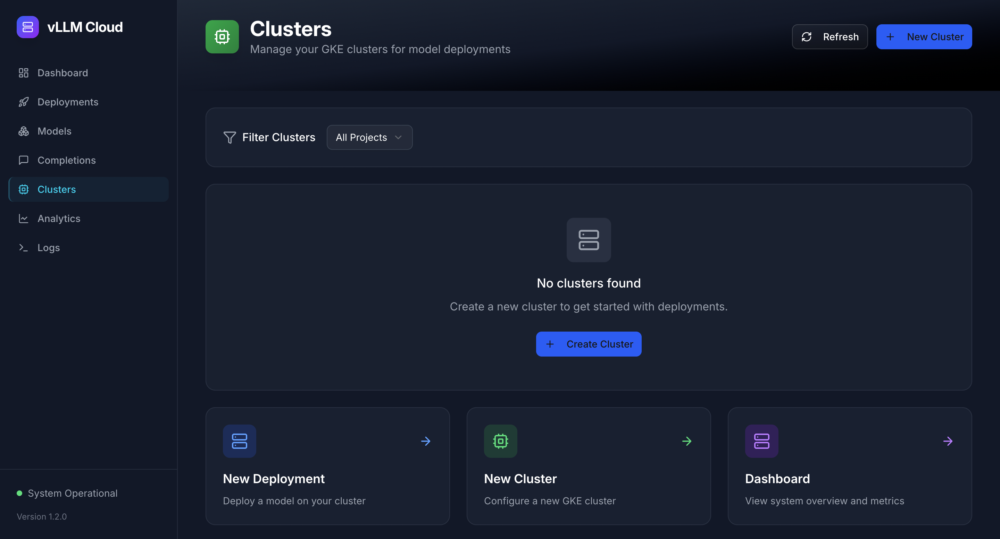

### 3.2 Configure Your Cluster

Fill in the cluster creation form:

1. **Project Information**:

   - Select your Project ID from the dropdown
   - Choose a Zone (e.g., us-central1-a), this is where your LLM will be served
   - The Cluster Name will be auto-generated, you can change it if you want

2. **CPU Node Configuration**:

   - Select Machine Type (e.g., e2-standard-8)
   - Set Number of Nodes (1-10)

3. **GPU Node Configuration**:
   - Enter GPU Pool Name
   - Select GPU Machine Type (e.g., g2-standard-16)
   - Choose GPU Type (e.g., NVIDIA L4)
   - Set GPU Nodes count
   - Configure GPUs per Node
   - Set Min/Max GPU Nodes for autoscaling

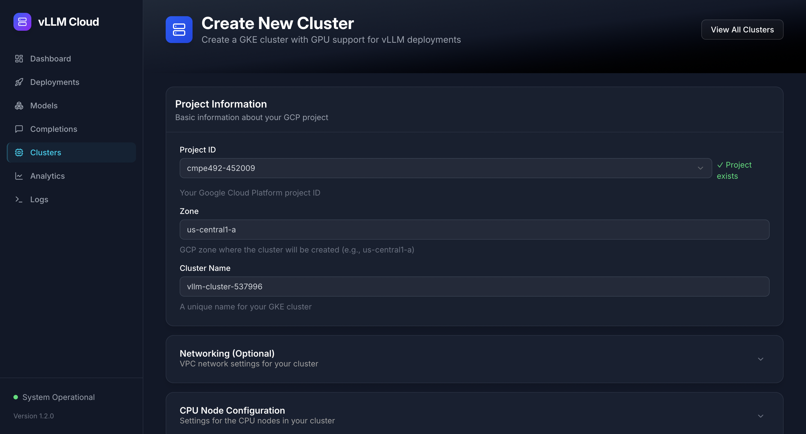

### 3.3 Create the Cluster

Click "Create Cluster" and wait for the cluster to be provisioned. This process typically takes 5-10 minutes.

You can monitor the cluster creation progress in the Cluster Details page:

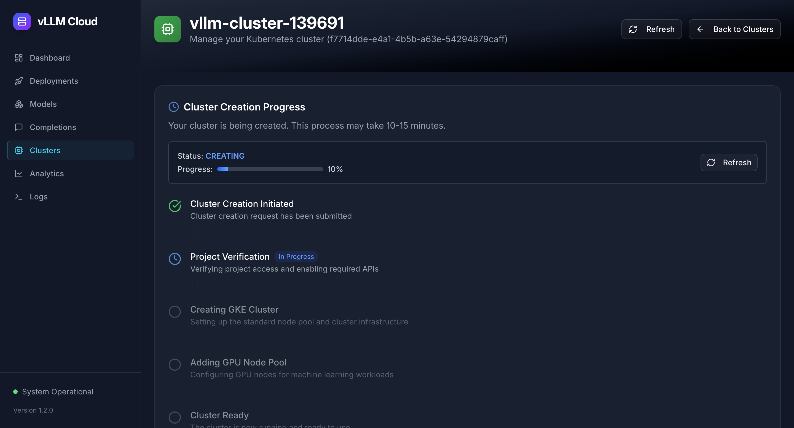

## 4. Deploying an LLM Model

### 4.1 Navigate to Deployment Creation

From the dashboard, click on "Deployments" in the sidebar, then click the "Create Deployment" button.

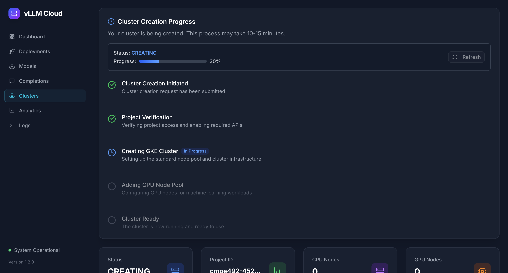

### 4.2 Configure Your Deployment

Fill in the deployment creation form:

1. **Basic Settings**:

   - Select your Target Cluster from the dropdown
   - Enter the Model Path (e.g., google/gemma-1.1-2b-it)
   - The Deployment Name will be auto-generated based on the model
   - Enter your Hugging Face Token if using a private model

2. **Advanced Settings** (optional):
   - Configure CPU Count
   - Select Memory (4GB, 8GB, 16GB, 32GB)
   - Set GPU Count
   - Choose GPU Type
   - Configure Data Type (bfloat16, float16, float32)
   - Set Tensor Parallel Size
   - Select Environment
   - Toggle Enable Chunked Prefill if needed

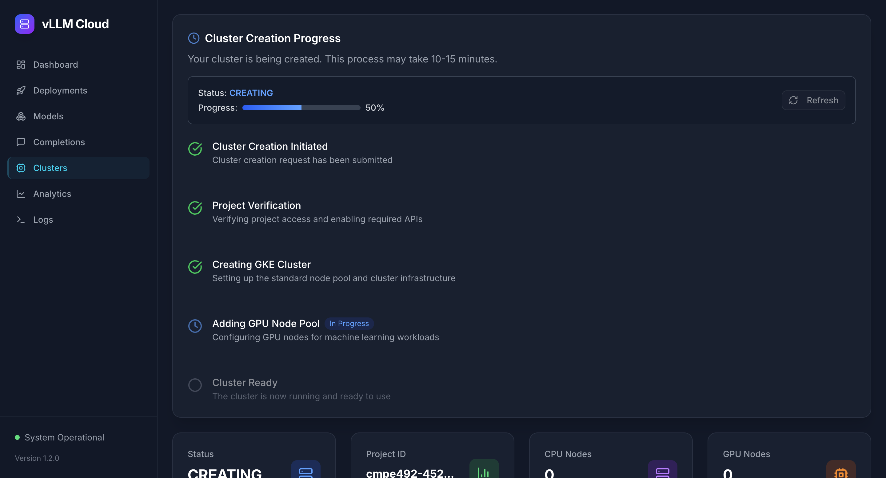

### 4.3 Create the Deployment

Click "Create Deployment" to start the deployment process. The system will:

1. Pull the model from Hugging Face
2. Create the necessary resources and deployments on the cluster
3. Deploy the vLLM service with your configuration

You can monitor the deployment progress in the Deployment Details page:

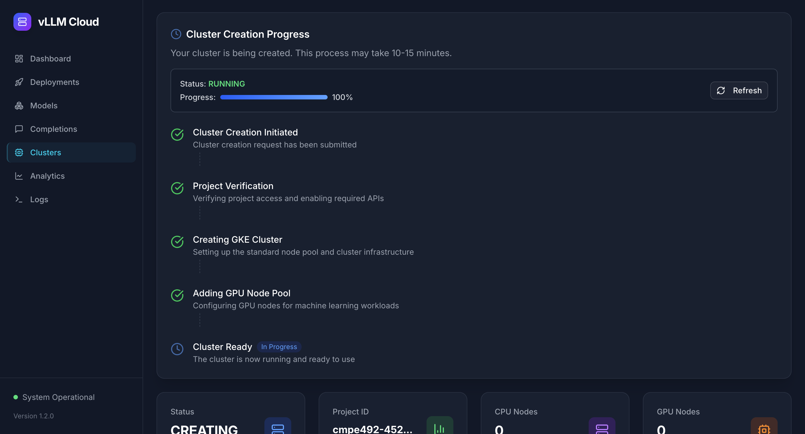

## 5. Interacting with Your Deployment

### 5.1 View Deployment Details

Once the deployment is complete, you can view its details by clicking on it in the Deployments list.

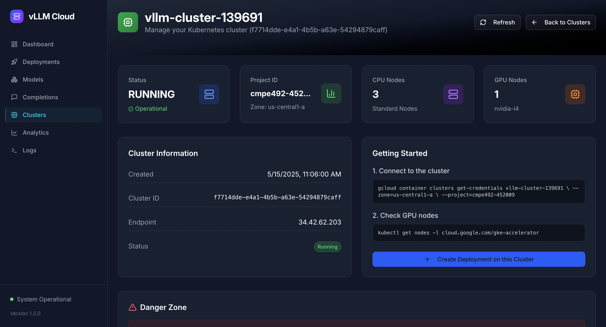

### 5.2 Chat with the Model

Click the "Chat with this model" button to open the Completions interface.

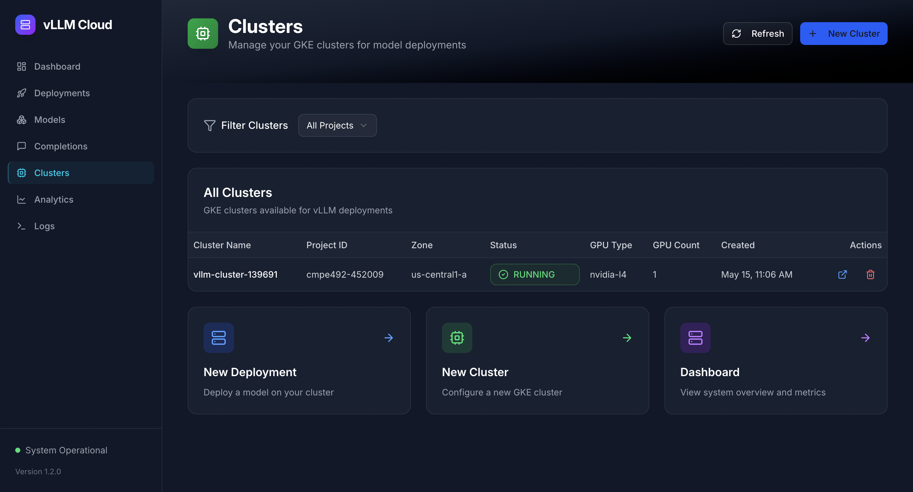

### 5.3 View API Usage Examples

The Deployment Details page provides API usage examples that you can copy and use in your applications.

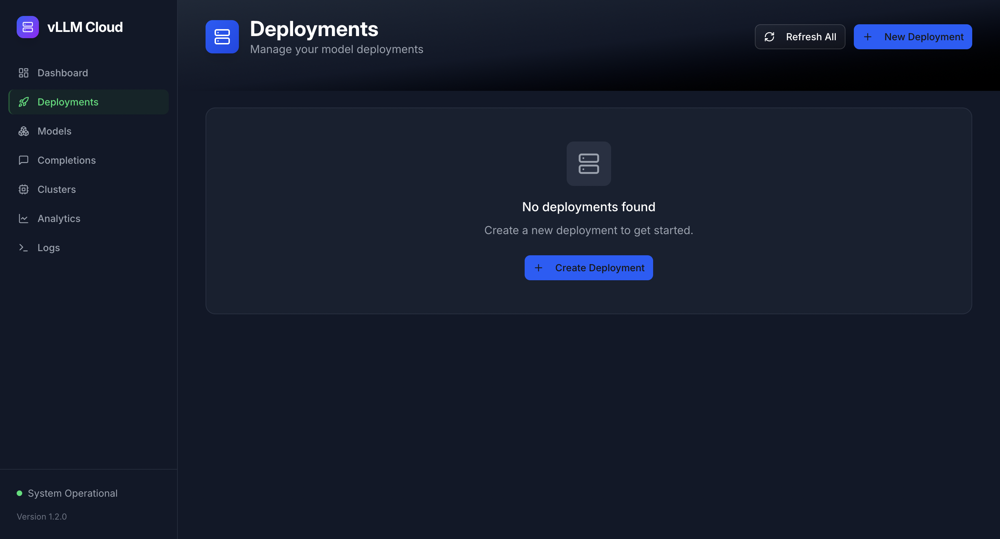

### 5.4 Monitor Logs

You can view real-time logs from your deployment by clicking the "Logs" tab.

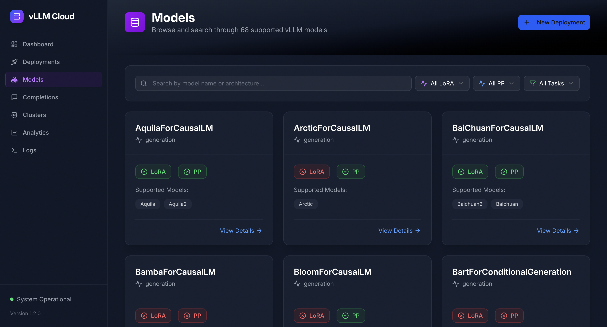

## 6. Monitoring Metrics

### 6.1 Navigate to Analytics

Click on "Analytics" in the sidebar to view performance metrics for your deployments.

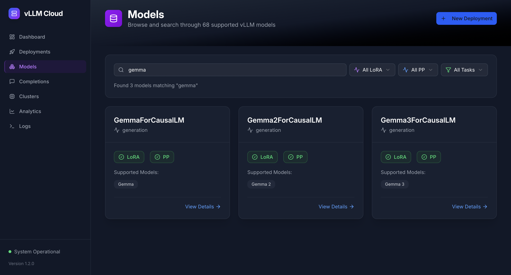

### 6.2 Available Metrics

The Analytics page displays various metrics:

- **Token Metrics**: Prompt Tokens, Generation Tokens, Total Tokens, Token Throughput
- **Timing Metrics**: Time to First Token, Time per Output Token
- **End-to-End Latency**: E2E Latency (P95, P50, P99)
- **Request Metrics**: Requests Completed, Requests per Second
- **GPU Metrics**: GPU Utilization, GPU Cache Usage

## 7. Troubleshooting

### 7.1 Check Deployment Status

If your deployment is not working as expected, check its status:

```bash
kubectl get pods -n vllm
```

### 7.2 View Detailed Logs

For more detailed logs, use:

```bash
kubectl logs -n vllm deployment/vllm-gemma
```

### 7.3 Check for Events

Look for any events that might indicate issues:

```bash
kubectl get events -n vllm
```

### 7.4 Common Issues and Solutions

#### Issue: Deployment stuck in "Pending" state

**Solution**: Check if there are enough resources in your cluster:

```bash
kubectl describe pod -n vllm
```

#### Issue: "Error: failed to pull model"

**Solution**: Verify your Hugging Face token is correct and has the necessary permissions.

#### Issue: GPU not detected

**Solution**: Ensure your cluster has GPU nodes and the NVIDIA drivers are properly installed:

```bash
kubectl get nodes -o json | jq '.items[].status.capacity | select(has("nvidia.com/gpu"))'
```
